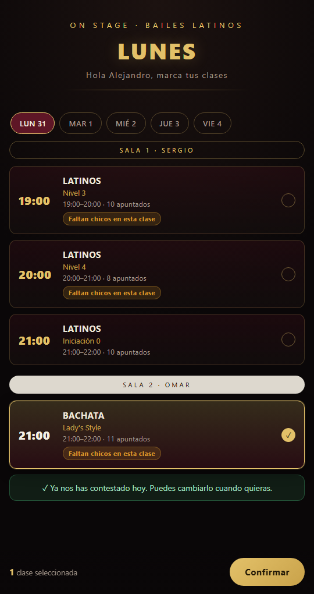
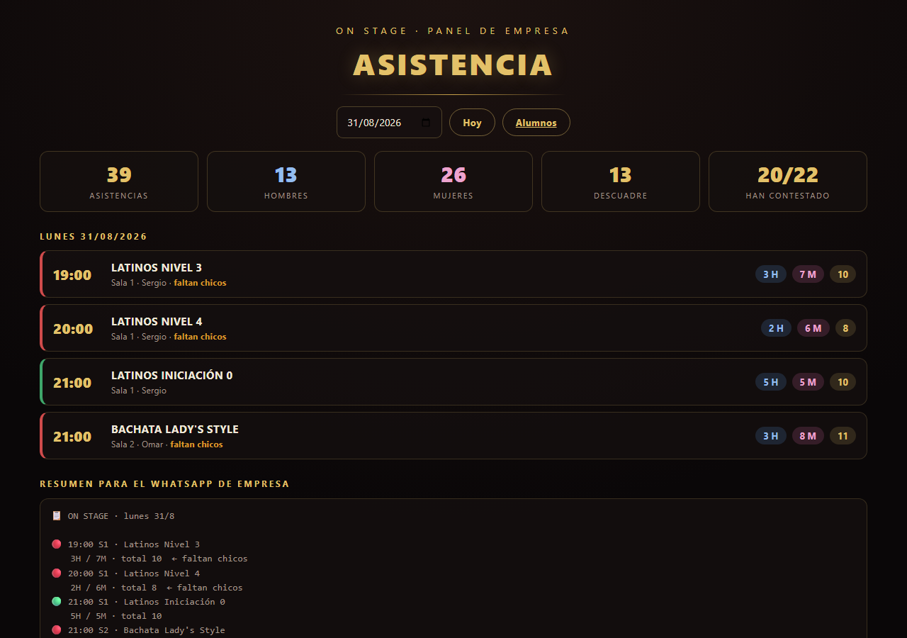
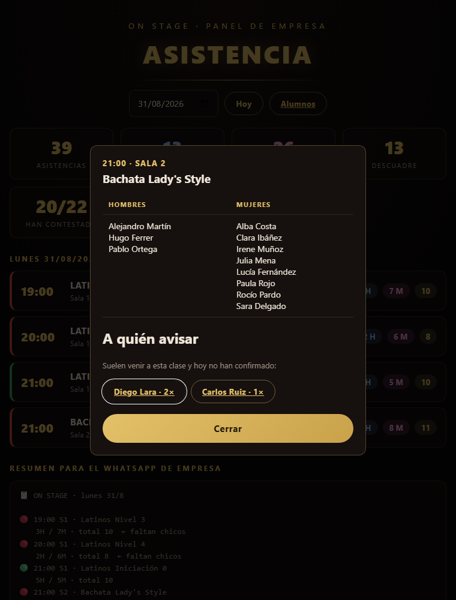
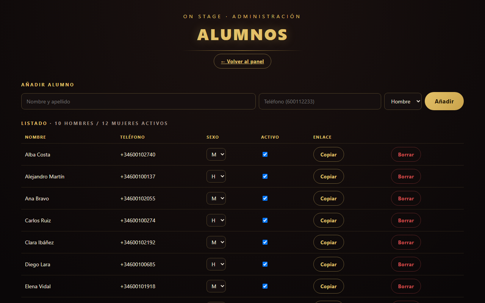
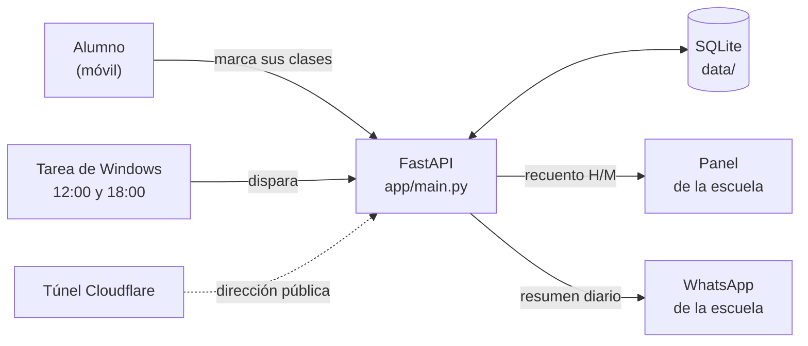

<h1 align="center">Asistencia · clases de baile</h1>

<p align="center">
  <b>Los alumnos dicen por WhatsApp a qué clases vienen hoy.<br>
  La escuela ve en tiempo real cuántos hombres y cuántas mujeres hay en cada una.</b>
</p>

<p align="center">
  
  
  
  
  
  
</p>

---

## El problema

En los bailes de pareja el total de alumnos no dice nada: lo que importa es que **cuadre**.
Una clase con 9 mujeres y 3 hombres deja a seis personas bailando solas o esperando turno, y
la escuela se enteraba de eso **cuando ya había empezado la clase**, sin margen para llamar a
nadie.

Contar a mano tampoco valía: los alumnos van a clases sueltas, cambian de día sobre la marcha
y avisan por WhatsApp a cuatro sitios distintos.

## La solución

```
  12:00  el sistema manda a cada alumno su enlace personal por WhatsApp
    ↓
  todo el día  el alumno toca las horas a las que va, desde el móvil, sin instalar nada
    ↓
  en directo  la escuela ve el recuento H/M por clase, con semáforo de descuadre
    ↓
  18:00  el WhatsApp de la escuela recibe el resumen del día
```

Y cuando una clase sale descompensada, el panel propone **a quién llamar**: los alumnos del
sexo que falta que suelen ir a esa clase y hoy no han contestado, con su botón de WhatsApp
listo. La sugerencia se calcula con el histórico de las últimas 6 semanas.

## Capturas

<table>
  <tr>
    <td width="38%" align="center"><b>El alumno, desde el móvil</b></td>
    <td width="62%" align="center"><b>El panel de la escuela</b></td>
  </tr>
  <tr>
    <td valign="top"></td>
    <td valign="top"></td>
  </tr>
</table>

<p align="center"><i>Datos de la demostración, generados con <code>scripts/demo.py</code>.</i></p>

**Y cuando una clase descuadra, quién falta por avisar.** Al pulsar una clase sale la lista
nominal por sexo y, debajo, los alumnos del sexo que falta que suelen venir a esa clase y hoy
no han confirmado — cada uno con su botón de WhatsApp listo:

<p align="center">
  
</p>

<details>
<summary><b>Alta y gestión de alumnos</b> (pulsa para ver)</summary>
<br>

</details>

## Cómo está montado



Sin build, sin `node_modules`, sin contenedores: tres pantallas de HTML, CSS y JavaScript
servidas por el propio FastAPI, y una base de datos que es **un fichero**.

| Módulo | Qué resuelve |
|---|---|
| [`app/horario.py`](app/horario.py) | El horario del cartel como dato. Se edita aquí y se propaga a las tres pantallas y a los resúmenes |
| [`app/db.py`](app/db.py) | SQLite: alumnos, asistencias, recuentos y el cálculo de a quién avisar |
| [`app/whatsapp.py`](app/whatsapp.py) | Redacción de los mensajes y los dos modos de envío |
| [`app/main.py`](app/main.py) | API REST y las tres páginas |
| [`web/`](web/) | Alumno, panel y administración |

## Decisiones de diseño

El encargo traía una restricción dura: **coste 0 €, sin alta de tarjeta en ningún sitio**.
Casi todo lo demás sale de ahí.

| Decisión | Alternativa descartada | Por qué |
|---|---|---|
| Enlaces `wa.me` que la escuela pulsa | WhatsApp Cloud API de Meta | La API es de pago y exige un número dedicado. El modo `cloud` está implementado y se activa con una variable, pero por defecto no hay factura |
| SQLite en un fichero | PostgreSQL gestionado | 22 alumnos y una escritura por persona y día. Un servidor de base de datos aquí solo añade coste y algo más que se puede caer |
| Túnel de Cloudflare | Render / Vercel en plan gratis | Sus planes gratuitos **borran el disco al reiniciar**, y con él la base de datos. El túnel es gratis de verdad y los datos se quedan en casa |
| Token permanente por alumno | Usuario y contraseña | Nadie quiere crearse una cuenta para decir que va a bailar. El enlace no caduca y sirve todos los días |
| Tareas del Programador de Windows | Un demonio propio | Lo que ya trae el sistema sobrevive a cerrar sesión y a reiniciar, y se reintenta solo si falla |
| Sexo guardado en el alta | Preguntarlo cada vez | Es el dato que da sentido al recuento y no cambia. Preguntarlo a diario sería fricción para nada |

La dirección pública del túnel cambia en cada arranque, así que la aplicación **la lee en
caliente** de `data/base_url.txt` en vez de fijarla al iniciar: los enlaces que se generan hoy
apuntan al túnel de hoy sin tocar configuración ni reiniciar nada.

## Puesta en marcha

```bash
pip install -r requirements.txt
cp .env.example .env        # cambia ADMIN_KEY y TELEFONO_EMPRESA
python -m uvicorn app.main:app --port 8000
```

| Página | Para qué | Quién entra |
|---|---|---|
| `/admin` | dar de alta alumnos | la escuela, con clave |
| `/panel` | ver el recuento del día | la escuela, con clave |
| `/a/<token>` | marcar las clases | cada alumno, con su enlace |

### Verlo con datos inventados

```bash
python scripts/demo.py
DB_PATH=data/demo.db python -m uvicorn app.main:app --port 8000
```

Crea 22 alumnos y tres semanas de respuestas, e imprime un enlace de panel y otro de alumno
para abrirlos directamente. Se borra con `python scripts/demo.py --limpiar`.

### Publicarlo en internet

```powershell
.\publicar.ps1
```

Descarga `cloudflared` la primera vez, arranca el servidor, abre el túnel, **lo vigila y lo
reabre solo si se cae**, y enseña la dirección pública. Sin cuenta, sin tarjeta y sin límite
de tiempo.

## Estructura

```
app/           lógica: horario, base de datos, mensajes y API
web/           las tres pantallas (HTML + CSS + JS, sin framework)
scripts/       enviar encuesta, resumen diario, importar CSV, demo
docs/MANUAL.md manual completo de operación
*.ps1          publicar, parar, programar tareas y comprobar estado
```

## Documentación

El **[manual de operación](docs/MANUAL.md)** cubre el día a día: importar alumnos desde CSV,
los dos modos de WhatsApp con el alta paso a paso en Meta, programar las tareas de Windows,
encender y apagar el servicio, cambiar el horario y las obligaciones de RGPD.

## Privacidad

El sistema guarda nombre, teléfono, sexo y asistencia de personas reales. El botón *Borrar*
de `/admin` elimina también todo el histórico del alumno. Este repositorio **no contiene datos
reales**: la base de datos está fuera del control de versiones y las capturas salen del
generador de demostración.

## Licencia

[MIT](LICENSE) · Alejandro Valero Collante
